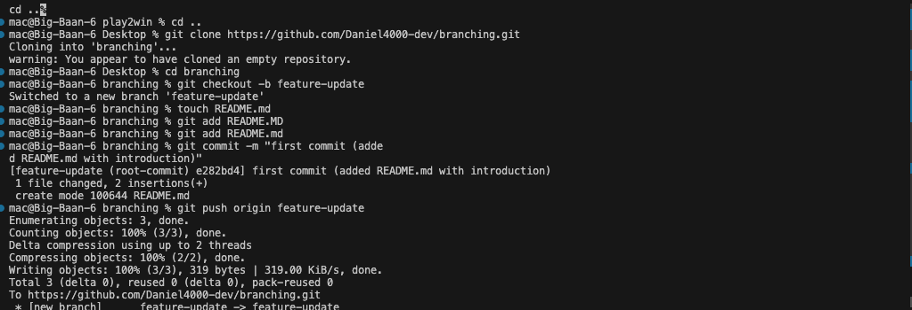

## Version Control and Branching
### Creating a new Github repository
- Go to my Github dashboard.
- Click on New to create a new repository.
- Enter name and choose public (so it can be visible to everyone).
- Did not initialize with a README.
- Click create repository

### Cloning the Repository Locally
- copy my repository url and run this command locally
```bash
git clone https://github.com/Daniel4000-dev/branching.git
```

### Create a New Branch called `feature-branch`
- In my project root directory i ran
```bash
git checkout -b feature-update
```

### Add a README.md File
- Created a new file name README.md
```bash
touch README.md
```
### Add Content to the file
- copied this to the file
```markdown
# About Me
Hi, I'm Daniel. Welcome to my Github repository.
```

### Commit the Changes
- Commited the changes by running 
```bash
git add README.md
git commit -m "first commit (added README.md with introduction).
```
### Push the `feature-update` Branch
- Push to the `feature-update` branch by running
```bash
git push origin feature-update
```

### Create a pull request (PR)
- In Github repository go to pull request tab.
- click New pull request (or compare and pull request which appears immediately after making your commit).
- Click Create pull request.

### Merge the PR
- Click merge pull request
- Click confirm merge

### Local Image
